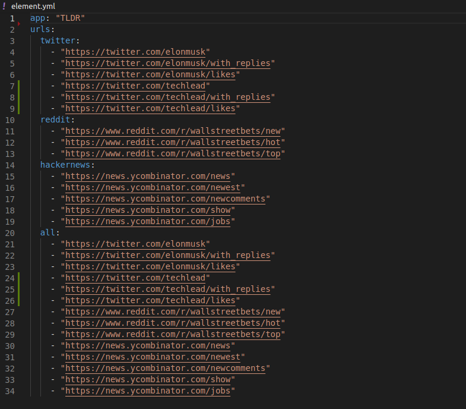
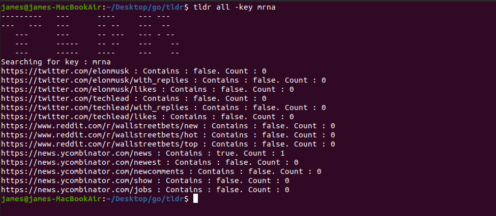
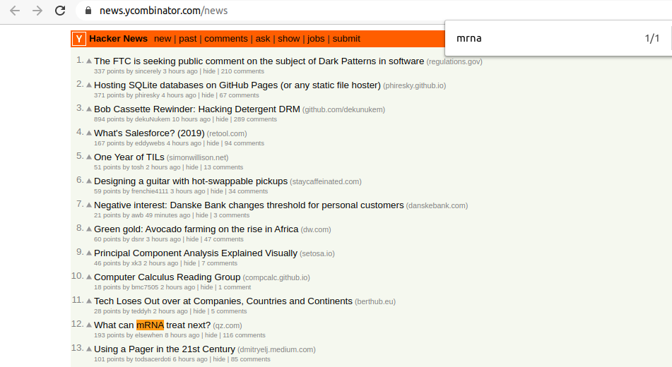

# TLDR


> A command line webscraping application written in GoLang that quickly finds searchable keys in many large social media webpages in one operation. 

TLDR is a command line tool to customize to your own interests. You add as many URLS as you desire into a ``yml`` file and enter a search key at runtime. When the command is called the application will run through all the webpages you provided and print out numeric feedback in regards to how many times what you're looking for is spoken about on the page which will allow you to make the decision whether to visit that page or not This saves you the time of clicking through the sequence of pages you usually do and looking yourself. Which explains the name: Too Long Didn't Read.


## Installation

Linux:

If you have GoLang installed. Clone the repository, CD into it and :

```sh
go run main.go 
```

To add webpages you want TLDR to scan through, add links for the pages in ``element.yml`` as the screenshot below shows :



Build and install if your Go path is setup so you can run it without being in the directory.

```sh
go build
go install
tldr twitter -h 
```

If you don't have Go installed there is a Docker container available for demonstration purposes but you will not be able to edit webpages to search without a separate configuration. Dockerhub: jhart87/tldr


## Usage example

Screenshots :




If you would like to add subcommands to search different things, maybe Facebook for example. Add an argument to the switch statement in Main.go(line 40) and add the pages you want looked at into ``element.yml``

_For more examples and usage, please refer to the [Wiki][wiki]._

## Release History

* 1.0.0
    * Minimum Viable Product


## Meta

James Hart – Hart87@gmail.com

Distributed under the Apache license. See ``LICENSE`` for more information.

[https://github.com/hart87/tldr](https://github.com/hart87/tldr)

## Contributing

1. Please submit any pull requests on the master branch. 

<!-- Markdown link & img dfn's -->
[npm-image]: https://img.shields.io/npm/v/datadog-metrics.svg?style=flat-square
[npm-url]: https://npmjs.org/package/datadog-metrics
[npm-downloads]: https://img.shields.io/npm/dm/datadog-metrics.svg?style=flat-square
[travis-image]: https://img.shields.io/travis/dbader/node-datadog-metrics/master.svg?style=flat-square
[travis-url]: https://travis-ci.org/dbader/node-datadog-metrics
[wiki]: https://github.com/yourname/yourproject/wiki
